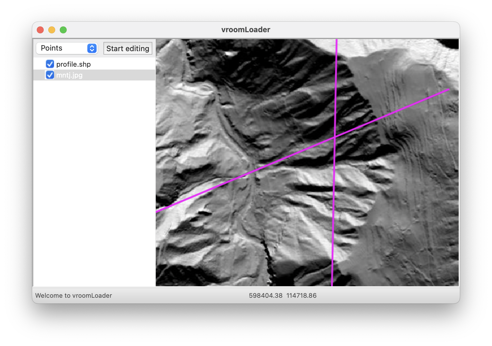
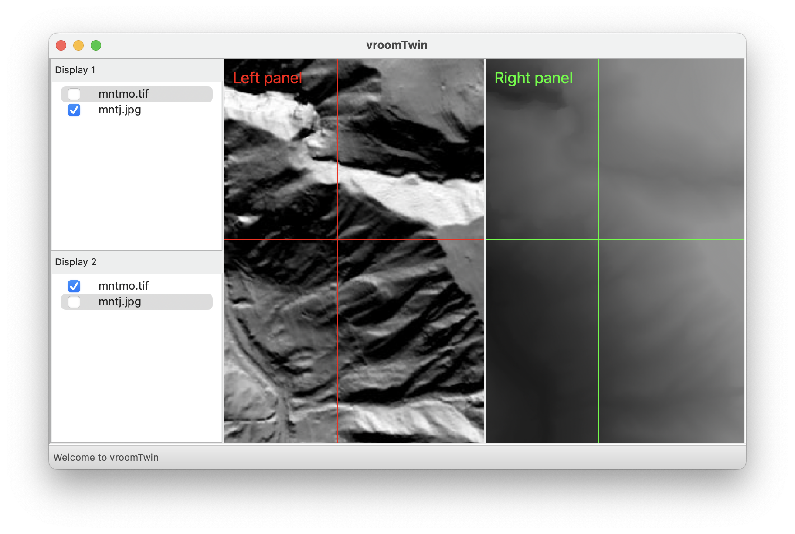

# vroomGIS


vroomGIS is an open source GIS toolkit. vroomGIS is written in C++ and uses the following open source libraries :

- [GDAL](https://gdal.org/) for reading and writing raster and vector data
- [wxWidgets](https://wxwidgets.org) wxWidgets for the GUI

## Building vroomGIS

vroomGIS uses [Conan](https://conan.io) and [CMake](https://cmake.org) as its construction system. Once these two programs have been installed, 
vroomGIS can be built using the following commands:

```bash
    mkdir cmake-build
    cd cmake-build
    conan install .. --build=missing
    conan build .. 
```

`conan install` supports the following options:

- `--build=missing` will build any missing dependencies from source
- `-s build_type=Release|Debug` will set the build type to Release or Debug
- `-o build_tests=True|False` (default = True) will build the unit tests if set to True
- `-o build_apps=True|False` (default = True) will build the applications (vroomLoader, vroomDrawer, vroomTwin) if set to True

## Running the tests

vroomGIS includes a series of unit tests to ensure code quality. These can be launched with the command: `ctest`.

## Sample applications

vroomGIS includes several sample applications that demonstrate its capabilities:

- **vroomLoader**: A simple application to load and display raster and vector data.
- **vroomDrawer**: An application to draw and manipulate vector data.
- **vroomTwin**: A tool for comparing two datasets visually.





    


