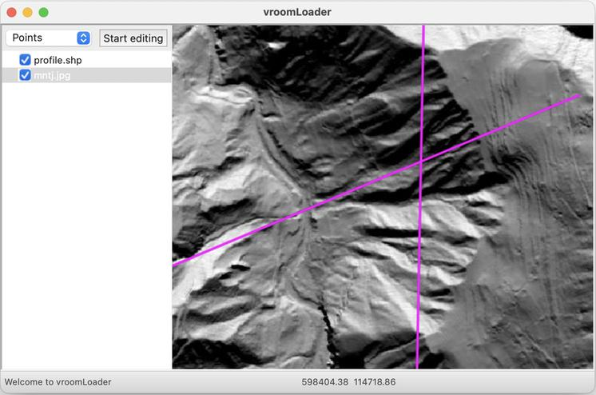
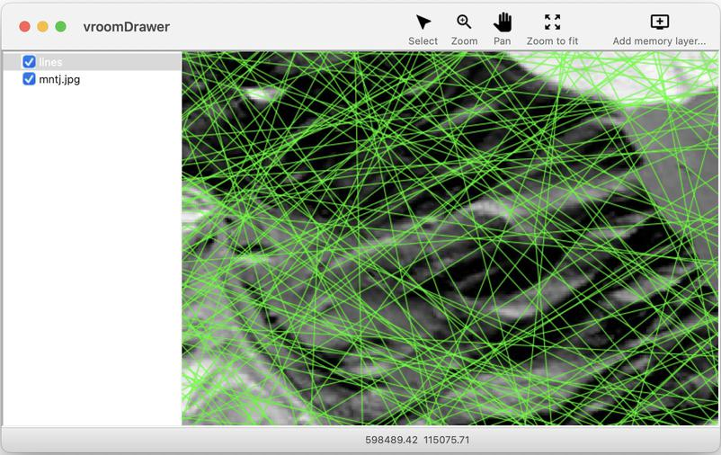
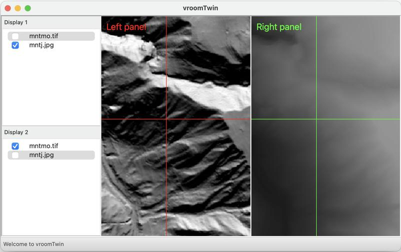

# vroomGIS


vroomGIS is an open source GIS toolkit. vroomGIS is written in C++ and uses the following open source libraries :

- [GDAL](https://gdal.org/) for reading and writing raster and vector data
- [wxWidgets](https://wxwidgets.org) wxWidgets for the GUI

## Building vroomGIS

vroomGIS uses [Conan 2](https://conan.io) and [CMake](https://cmake.org).
From the repository root, install the dependencies and build using:

```bash
conan install . --build=missing --build='~gdal/*'
conan build .
```

The GDAL exclusion requires an available GDAL binary; other missing dependencies
are built from source. With CMake 3.23 or newer, the generated presets can also be
used directly after installation:

```bash
cmake --preset conan-release
cmake --build --preset conan-release
```

Conan supplies `CMakeToolchain` and `CMakeDeps`; CMake links the imported package
targets instead of loading the Conan 1 `conanbuildinfo.cmake` file.

`conan install` supports the following options:

- `--build=missing` will build any missing dependencies from source
- `-s build_type=Release|Debug` will set the build type to Release or Debug
- `-o build_tests=True|False` (default = True) will build the unit tests if set to True
- `-o build_apps=True|False` (default = True) will build the applications (vroomLoader, vroomDrawer, vroomTwin) if set to True

## Running the tests

Run the tests from the repository root with `ctest --preset conan-release --output-on-failure`.
The GUI tests need a display. On a headless Linux machine with Xvfb installed, use
`xvfb-run -a ctest --preset conan-release --output-on-failure`.

## Sample applications

vroomGIS includes several sample applications that demonstrate its capabilities:

- **vroomLoader**: A simple application to load and display raster and vector data.
- **vroomDrawer**: An application to draw and manipulate vector data.
- **vroomTwin**: A tool for comparing two datasets visually.





## Developper documentation

The developer documentation is available in the `doc` directory. To build the documentation, you can use Doxygen.

```bash
    cd doc
    doxygen Doxyfile
```

    

